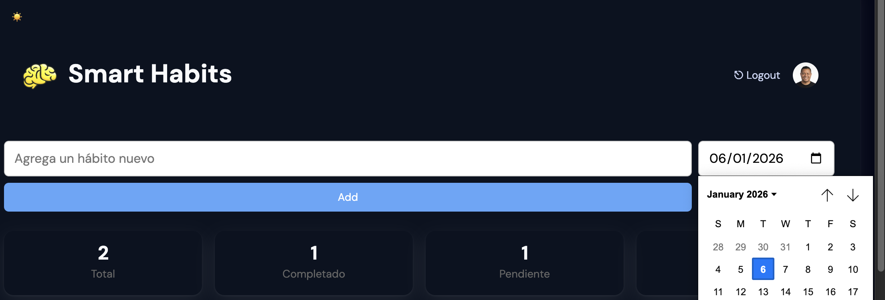
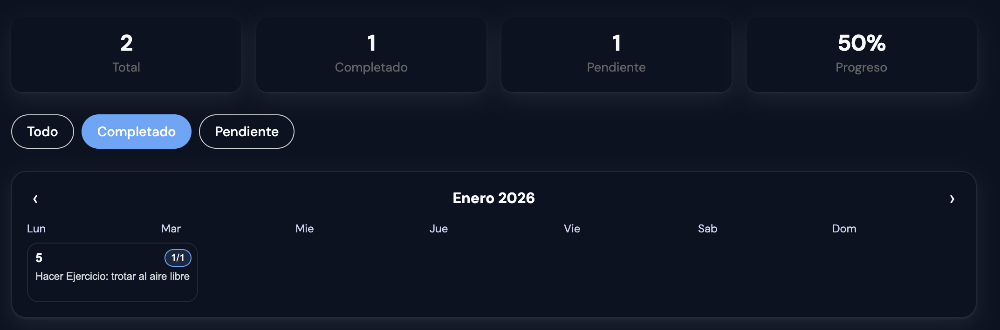
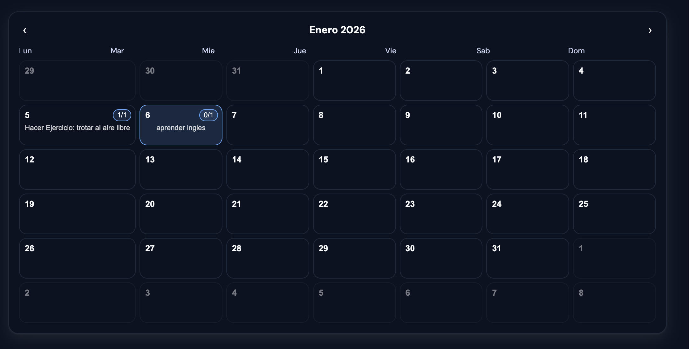
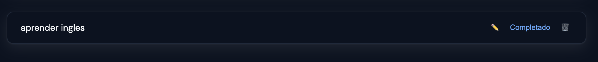

# Smart Habits 🧠✨

<p align="center">
  
</p>


Smart Habits es una aplicación web moderna para gestionar hábitos diarios, construida con **Angular (standalone + signals)** y enfocada en **arquitectura limpia, accesibilidad y diseño adaptable (Light / Dark mode)**.

---

## 🚀 Features

### Crear y completar hábitos
<p align="center">
  
</p>

### Estadísticas en tiempo real
<p align="center">
  
</p>

### Filtros y calendario
<p align="center">
  
</p>

### Light & Dark mode
<p align="center">
  
</p>


- 💾 Persistencia de datos 
- ♿ Accesibilidad (ARIA, semantic HTML) y diseño responsive
- 🧱 Arquitectura escalable y desacoplada




---

## 🧩 Tech Stack

- **Angular 19+**
  - Standalone components
  - Signals
- **TypeScript**
- **CSS Variables (Design Tokens)**
- **LocalStorage**
- **Semantic HTML + ARIA**

---

## 🗂️ Project Structure

```txt
src/
├── app/
│   ├── core/
│   │   └── services/
│   │       └── theme/
│   │           └── theme.service.ts
│   │
│   ├── features/
│   │   └── habits/
│   │       ├── components/
│   │       │   ├── habit-form/
│   │       │   ├── habit-list/
│   │       │   ├── habit-stats/
│   │       │   └── habit-filters/
│   │       ├── store/
│   │       │   └── habits.store.ts
│   │       └── models/
│   │           └── habit.model.ts
│   │
│   ├── app.component.ts
│   └── app.routes.ts
│
├── styles.css
└── main.ts
```
## ▶️ Ejecucción proyecto 

**Requisitos**

- Node.js 18 o superior
- Angular CLI 19 o superior
- npm install -g @angular/cli

**Instalación**
- npm install
- Ejecutar en desarrollo
- ng serve

- Abrir en el navegador: http://localhost:6200

